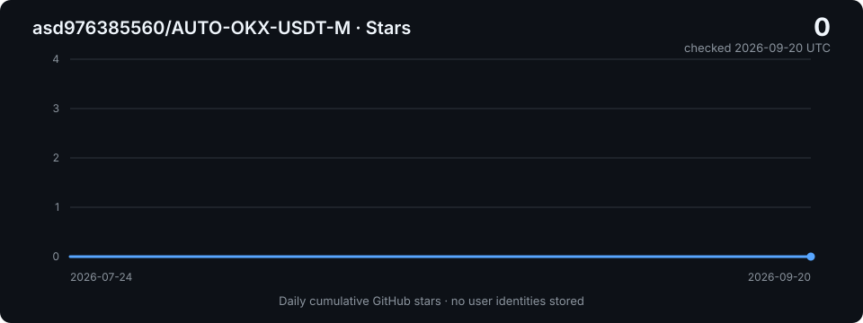

<p align="center">
  <strong>简体中文</strong> · <a href="README.en.md">English</a>
</p>

<h1 align="center">AUTO-OKX-USDT-M</h1>

<p align="center">面向 OKX USDT 永续合约的自主交易系统 V2.0</p>

<p align="center">
  <a href="https://github.com/asd976385560/AUTO-OKX-USDT-M/stargazers"></a>
  <a href="https://github.com/asd976385560/AUTO-OKX-USDT-M/network/members"></a>
  <a href="https://github.com/asd976385560/AUTO-OKX-USDT-M/commits/main"></a>
</p>

V2.0 将市场采集、风控、下单、记账、推送和阶段派发放在确定性代码中，将分析、交易判断、复盘和无 API 新闻取数交给隔离 Agent。系统同时支持 live 与 demo；两者共用同一套硬风控和止损要求，只切换执行环境。

> [!WARNING]
> 本项目包含真实交易执行能力。首次部署必须保持 `OKX_EXECUTOR_DRYRUN=1` 和 `OKX_TRIGGER_DRYRUN=1`，并在隔离数据库中完成验证。本项目不构成投资建议，也不保证盈利。

## 目录

- [公开发布边界](#公开发布边界)
- [版本线说明](#版本线说明)
- [架构](#架构)
- [Agent 角色](#agent-角色)
- [快速开始](#快速开始)
- [部署 Agent](#部署-agent)
- [配置定时任务](#配置定时任务)
- [配置与安全验证](#配置与安全验证)
- [风控摘要](#风控摘要)
- [Stars 趋势](#stars-趋势)

## 公开发布边界

公开版本只包含源码、Agent 角色规则、模板、数据库 DDL、配置示例和公开文档，不包含：

- `config.md`、`.env*` 或任何真实凭证；
- SQLite 运行库、WAL/SHM、日志、报告、记忆和临时文件；
- QQ/Webhook 真实目标、账户、设备、Agent 或主机标识；
- 本地依赖目录 `Lib/`、缓存和字节码；
- 真实 OpenClaw 配置、cron job ID、模型分配和宿主状态；
- 内部宿主运维资料、历史归档和一次性兼容脚本。

复制 `config.example.md` 为本地 `config.md` 后再填写。凭证读取以环境变量为最高优先级；公开代码中没有真实值或可用默认凭证。

## 版本线说明

当前源码事实源自称 `V2.0`。GitHub 远端旧 README 曾使用 `v3.1` 标识，两者不是本次同步中自动推导出的可比较语义版本。本次不创建标签或 Release；最终公开版本号由维护者另行决定。

## 架构

```text
OpenClaw cron
  ├─ fast_collect.py ───────────────┐
  ├─ slow_collect.py ───────────────┼─> ledger.db
  └─ sources/news_collect.py ───────┘
                                      │
                                      v
                              core/dispatcher.py
                                      │
                    stage_dispatch 唯一键幂等闩锁
                                      │
                 ┌────────────────────┴───────────────────┐
                 v                                        v
       unified live trader                         demo trader
       analysis + live execution                   demo execution
                 │                                        │
                 └───────────────┬────────────────────────┘
                                 v
                     scripts/push_pipeline.py
                     render -> validate -> archive/send
```

核心不变量：

- `skill.md` 是 V2.0 业务事实源，本文是公开系统地图；
- `ledger.db.stage_dispatch(cycle_id, stage)` 是阶段派发幂等真值；
- 每张表或明确键域只有一个权威 writer，读者使用 SQLite `mode=ro`；
- live 开仓只经 `core/order_executor.py`，内部强制调用 `core/risk_validator.py`；
- live/demo 都要求止损，并共用同一套硬上限；
- 当前持仓以 OKX API 为准，不能由本地快照推断；
- push 固定走 `scripts/push_pipeline.py`，不由 Agent 临时拼接执行链。

## Agent 角色

| Agent | 公开角色源 | 职责 | 默认触发 |
|---|---|---|---|
| analyst | `agents/analyst.md` | 人工回滚分析，不参与默认主链 | 手工 |
| unified live trader | `agents/live_trader.md` | 分析、实盘判断、硬风控和执行 | dispatcher |
| demo trader | `agents/demo_trader.md` | 共用分析与硬风控的模拟执行 | dispatcher |
| news scout | `agents/news_scout.md` | X/无 API 新闻取数和结构化 | 独立 cron，可选 |
| reviewer | `agents/reviewer.md` | 日/周/月复盘和经验摘要 | 日频 cron |

每个 Agent 使用独立 OpenClaw workspace，并将自己的角色文件部署为 `AGENTS.md`。模型、通道、工具权限和真实 workspace 路径只在部署环境配置，不进入仓库。

## 快速开始

运行依赖：

- Python 3.11 或更高版本；
- `httpx`；
- SQLite（Python 标准库）；
- Agent 调度需要 OpenClaw；
- 实际下单需要在仓库外配置 OKX CLI profile；
- Windows 包装器和运维脚本使用 PowerShell 7。

```powershell
git clone https://github.com/asd976385560/AUTO-OKX-USDT-M.git
Set-Location AUTO-OKX-USDT-M

python -m pip install -r requirements.txt
Copy-Item config.example.md config.md

$env:OKX_ROOT = (Resolve-Path .).Path
$env:OKX_DB_ROOT = Join-Path $env:OKX_ROOT 'db'
$env:OKX_EXECUTOR_DRYRUN = '1'
$env:OKX_TRIGGER_DRYRUN = '1'
```

首次验证必须使用隔离数据库：

```powershell
$isolatedDb = Join-Path $env:TEMP 'auto-okx-v20-db'
python scripts/init_v20_dbs.py --root $isolatedDb --verify
python collectors/sources/_registry.py --validate
python scripts/check_trader_docs_sync.py
```

## 部署 Agent

以下示例只创建 workspace，不配置真实模型、消息通道或凭证：

```powershell
$openclawRoot = Join-Path $HOME '.openclaw'

openclaw agents add okx-analyst --workspace (Join-Path $openclawRoot 'workspace-okx-analyst') --non-interactive
openclaw agents add okx-live-trader --workspace (Join-Path $openclawRoot 'workspace-okx-live-trader') --non-interactive
openclaw agents add okx-demo-trader --workspace (Join-Path $openclawRoot 'workspace-okx-demo-trader') --non-interactive
openclaw agents add okx-news-scout --workspace (Join-Path $openclawRoot 'workspace-okx-news-scout') --non-interactive
openclaw agents add okx-reviewer --workspace (Join-Path $openclawRoot 'workspace-okx-reviewer') --non-interactive

openclaw agents list
```

随后把每个 `agents/<role>.md` 复制为相应 workspace 的 `AGENTS.md`，并复制匹配的 `IDENTITY.md` 与 `SOUL.md`。完整步骤、角色映射、权限边界、dry-run 验证和回滚方式见：

- [Agent 与 OpenClaw 部署指南（中文）](docs/agent-deployment.zh-CN.md)
- [Agent and OpenClaw Deployment Guide (English)](docs/agent-deployment.en.md)

## 配置定时任务

默认调度口径来自 `skill.md`：

| 工作 | 类型 | 调度 |
|---|---|---|
| fast collect | command | `0,15,30,45 * * * *` |
| slow collect | command | `2 * * * *` |
| dispatcher | command | `*/2 * * * *` |
| registry news | command | `3,18,33,48 * * * *` |
| news scout | agent | `5,20,35,50 * * * *`，可选 |
| daily maintenance | command | 每日一次，启用前必须单独授权 |
| reviewer | agent | 每日一次 |

创建定时任务前必须保持 dry-run，并用占位符替换本机路径：

```powershell
openclaw cron create '*/2 * * * *' `
  --name 'okx-dispatcher' `
  --command-argv '["python","<PROJECT_ROOT>/core/dispatcher.py","--db-root","<ISOLATED_DB_ROOT>"]' `
  --timeout-seconds 120 `
  --no-deliver
```

用 `openclaw cron list`、`openclaw cron show <CRON_JOB_ID>` 和 `openclaw cron run <CRON_JOB_ID> --wait` 核验。公开仓库不提供真实 job ID，也不会自动修改本机 cron。

## 配置与安全验证

主要环境变量：

| 变量 | 用途 |
|---|---|
| `OKX_ROOT` | 项目根目录；未设置时从源码位置推导 |
| `OKX_DB_ROOT` | 数据库目录；默认 `<PROJECT_ROOT>/db` |
| `OKX_PYTHON_BIN` | Python 可执行文件 |
| `OKX_SITE_PACKAGES` | 可选额外依赖目录 |
| `OKX_CONFIG_MD` | 本地配置页；默认 `<PROJECT_ROOT>/config.md` |
| `FRED_API_KEY` | FRED 数据源凭证 |
| `COINGECKO_API_KEY` | CoinGecko 数据源凭证 |
| `MX_APIKEY` | 妙想数据源凭证 |
| `OKX_PROXY_URL` | 可选代理 URL |
| `OKX_QQ_TARGET` | QQ 目标；无默认值 |
| `OKX_EXECUTOR_DRYRUN` | `1` 时阻止交易变更命令 |
| `OKX_TRIGGER_DRYRUN` | `1` 时阻止 Agent/push 起棒 |

不访问交易所、不推送、不写运行数据库的基础检查：

```powershell
python -m compileall -q collectors core scripts
python collectors/sources/_registry.py --validate
python scripts/check_trader_docs_sync.py
python scripts/update_star_stats.py --self-test
```

涉及数据库的工具必须传入隔离目录。涉及 Agent、QQ、OpenClaw 或 OKX 的入口只允许 dry-run，或在缺少外部环境时明确跳过。

## 风控摘要

权威值以 `core/risk_validator.py` 为准：

- 单笔保证金最多为权益的 20%（`MAX_MARGIN_PCT`）；
- 最多使用当前可用 USDT 保证金的 98%（`AVAILABLE_MARGIN_USE_PCT`）；
- 杠杆不超过 10x（`MAX_LEVERAGE`）；
- 单笔名义价值不低于权益的 1%（`MIN_NOTIONAL_PCT`）；
- 止损偏离 mark price 不超过 30%（`MAX_SL_DEVIATION`）；
- 合约规格、余额、可用保证金或成交确认缺失时 fail-safe 拒绝。

这些限制没有因公开发布、文档国际化或 Stars 统计而修改。

## Stars 趋势

动态徽章显示当前 Stars 数；下图由仓库自己的 GitHub Actions 每 6 小时检查并生成，只保存每日聚合数量，不保存用户身份。

[](https://github.com/asd976385560/AUTO-OKX-USDT-M/stargazers)

统计脚本仅使用工作流运行期间的仓库级 `GITHUB_TOKEN`，不需要个人 PAT，也不会把 Token 写入文件、日志或图表。明细见 `docs/data/star-history.json`。

## 安全报告

发现凭证或公开历史泄漏时，不要在 issue 中粘贴真实值。请先轮换凭证，再通过私密渠道联系维护者。更多边界见 [SECURITY.md](SECURITY.md) 和 [PUBLIC_RELEASE.md](PUBLIC_RELEASE.md)。
